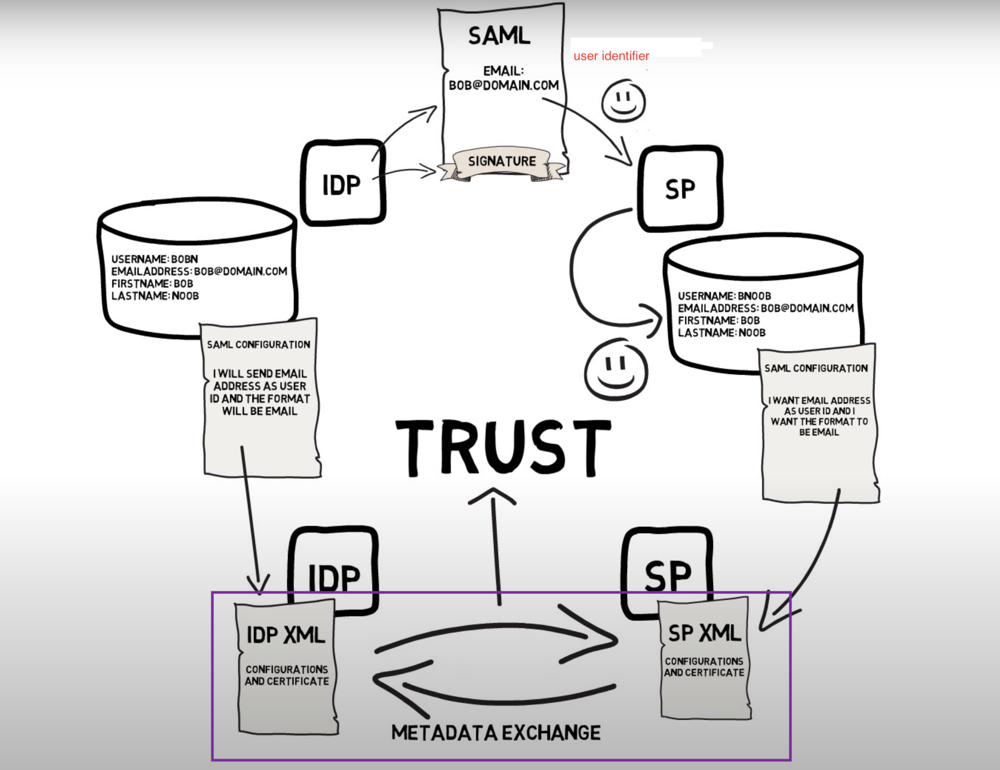
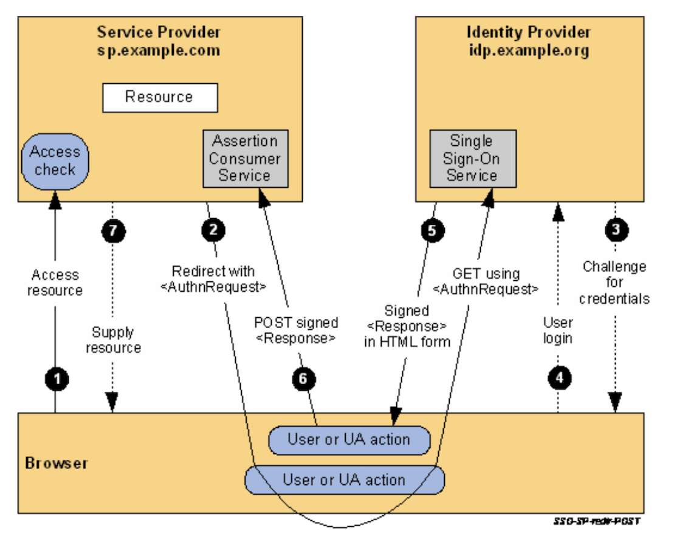
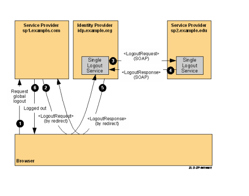
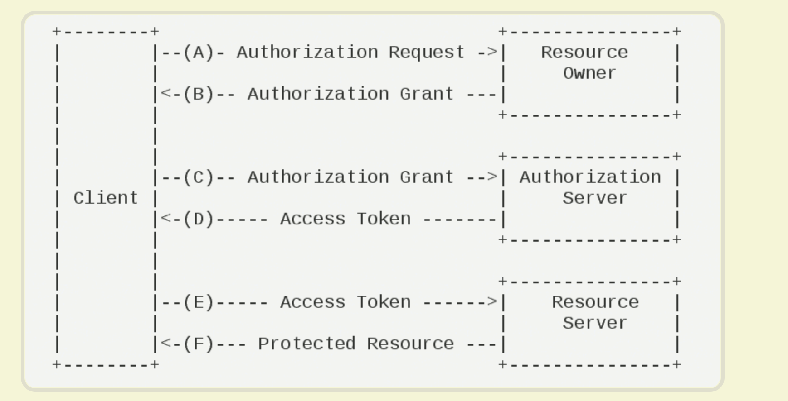
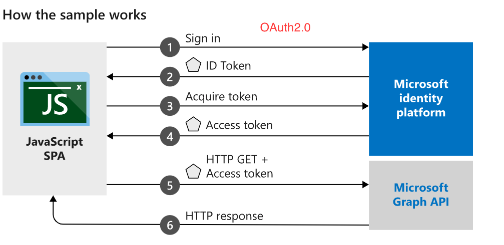

# saml

## saml 

saml的metadata互换（本质是核心信息的统一）

### saml single sign on (sso)
sp-initiate flow:

**saml只是认证的协议；**
#### ps1:
最后要生成自己的token,create a local logon security context for the user at the SP。

来自http://docs.oasis-open.org/security/saml/Post2.0/sstc-saml-tech-overview-2.0-cd-02.html#5.1.2.SP-Initiated%20SSO:%20%20Redirect/POST%20Bindings|outline

#### ps2:  
有个参数NotBefore and NotOnOrAfter attributes,但是
The NotBefore and NotOnOrAfter attributes specify the interval during **which the assertion is valid**.

如果使用azure作为idp:
The value of the NotBefore attribute is equal to or slightly (less than a second) later than the value of IssueInstant attribute of the Assertion element. Azure AD does not account for any time difference between itself and the cloud service (service provider), and does not add any buffer to this time.
The value of the NotOnOrAfter attribute is 70 minutes later than the value of the NotBefore attribute.

https://docs.microsoft.com/en-us/azure/active-directory/develop/single-sign-on-saml-protocol

### single logout (slo)

#### slo
http://docs.oasis-open.org/security/saml/Post2.0/sstc-saml-tech-overview-2.0.html

SLO allows a user to terminate all server sessions established via SAML SSO by initiating the logout process once. 

Cookie Solution：
多个服务的cookie放在一起，一个登出之后，删除这个cookie,就可以实现。

如果使用azure作为idp,Azure AD solution:
1. https://docs.microsoft.com/en-us/azure/active-directory/develop/single-sign-out-saml-protocol

2. Azure 一个 tenant 下面，有多个app 的话，其中一个 app， 从 AzureAD logout 的时候，Azure会通知同一个 tenant 下的app，如果其他的APP，配置了 logout url，这个logout url 也是会被调用的。

When you use single sign on (SSO), then application has its own session for the user and there is an active session with Azure AD. When the user want to do the logout from the application and with Azure AD then in that case application should send the Logout Request to Azure AD after ending the application session. This way Azure AD can logout the user from the active Azure AD session.

If the application is using SAML protocol then the application should send the SAML Logout request to Azure AD. If the application is not using SAML then you can use the common logout endpoint - https://login.microsoftonline.com/common/wsfederation?wa=wsignout1.0 

https://social.msdn.microsoft.com/Forums/azure/en-US/0c5b6bf7-dc14-4d14-8d8b-aadec0801d2d/azure-ad-single-logout-configuration?forum=WindowsAzureAD

### 如果使用azure AD作为IDP

有的时候是 Azure Multi-Factor Authentication
有的时候是 Single-Factor Authentication

设置Control access policy也就是设置不同状况下的认证策略，包括user frequency。
（用户通过什么方式 以什么频率 让微软相信他是谁）

debug看
https://portal.azure.com/#blade/Microsoft_AAD_IAM/ActiveDirectoryMenuBlade/SignIns

1. metadata可以用passport-metadata-saml这个库生成但是不一定必须要，关键信息和azure之间共享就可以

2. saml中attribute或者nameID可能会出现敏感信息 而且 应该是明文传输 需要解决吧
smart db后台和微软连接一次 验证token

5. 登录界面是用azure的那个登录吗？
survey 登录成功页面 -》 Yukari登录成功之后 跳转到这个页面

6. sp这边有必要签名吗? 现在好像都没有用到
好像不需要

7. 用户信息在azure的设置
只有用户

#### azure cookie
ESTSAUTHPERSISTENT
ESTSAUTH
ESTSAUTHLIGHT
**domain**=.login.microsoftonline.com;

#### azure Single sign-on session tokens
When a user authenticates with Microsoft identity platform, a single sign-on session (SSO) is established with the user’s browser and Microsoft identity platform. The SSO token, in the form of a cookie, represents this session. The SSO session token is not bound to a specific resource/client application. SSO session tokens can be revoked, and their validity is checked every time they are used.

Microsoft identity platform uses two kinds of SSO session tokens: persistent and nonpersistent. Persistent session tokens are stored as persistent cookies by the browser. Nonpersistent session tokens are stored as session cookies. (Session cookies are destroyed when the browser is closed.) Usually, a nonpersistent session token is stored. But, when the user selects the Keep me signed in check box during authentication, a persistent session token is stored.

**Nonpersistent session tokens have a lifetime of 24 hours.Persistent tokens have a lifetime of 90 days.** **Anytime an SSO session token is used within its validity period, the validity period is extended another 24 hours or 90 days, depending on the token type.** If an SSO session token is not used within its validity period, it is considered expired and is no longer accepted.

## 基本的一些定义
1. authorize :
   1. proving you are who you say you are  
   2. OAuth
2. authenticate: 
   1. granting an authenticated party permission to do something example:使用微信登录微博
   2. OpenID(OIDC) saml

## 其他
openID：
1. built upon OAuth2.0
2. openid - purely in cloud  <>  saml - ADFS... **for Enterprise**
待补充..

OAuth2.0:

Authorization server 可以 = Resource Owner

D步骤中，认证服务器发送的HTTP回复，包含以下参数：
access_token：表示访问令牌，必选项。
token_type：表示令牌类型，该值大小写不敏感，必选项，可以是bearer类型或mac类型。
expires_in：表示过期时间，单位为秒。如果省略该参数，必须其他方式设置过期时间。
refresh_token：表示更新令牌，用来获取下一次的访问令牌，可选项。
scope：表示权限范围，如果与客户端申请的范围一致，此项可省略。

example:

定义+其他部分：
https://docs.microsoft.com/en-us/azure/active-directory/develop/authentication-vs-authorization
https://www.ruanyifeng.com/blog/2014/05/oauth_2_0.html